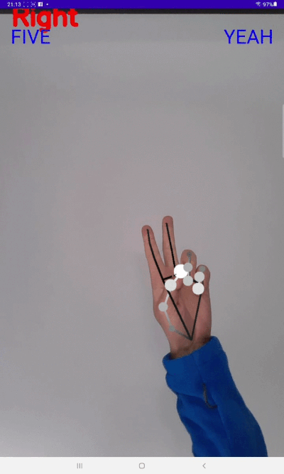

Android Demo for two hands gesture recognition with Mediapipe SDK 

It is found that Mediapipe provides a very powerful SDK for developing application with motion tracking. This demo only works with hand detection and tracking. By processing the landmarks which is outputs from the mediapipe hand tracking pipeline, it is possbile to work on gesture recongntion for either left or right hands, also both hands together. 

Installation:  

Plese see these [instructions](https://google.github.io/mediapipe/getting_started/android_archive_library.html) from mediapipe website for how to complie Android Archive (AAR).

Hand tracking and Gesture recognition:

1. [Mediapipe Hand tracking Solution](https://google.github.io/amediapipe/solutions/hands.html)

2. [Simple Hand Gesture Recognition Code](https://gist.github.com/TheJLifeX/74958cc59db477a91837244ff598ef4a)

